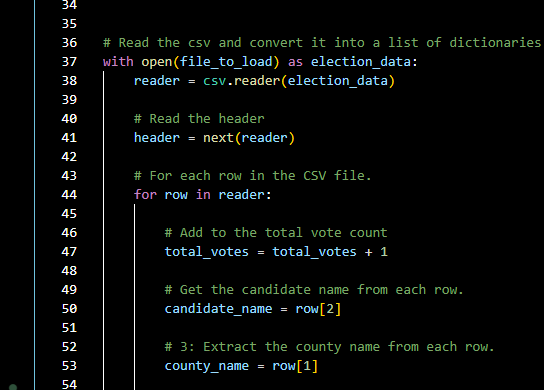

## PyPoll with Python

### Overview of Election Audit

I have been working with Tom and his manager, Seth, to audit the results from an election in Arizona for the election commission. Since our initial audit, the commission has asked for additional data on the county results from the election in addition to the candidate results we compiled. The following audit compiles both the candidate and county results using Python code from a source CSV file and then outputs those results not only in the terminal/shell, but in a TXT file for easy reading by non-technical individuals.   

### Election-Audit Results

Tom, Seth, and I presented the following election outcomes to the commission:

- 369,711 votes were cast in this election. The following images illustrate the code initializing and incrementing the total vote counts. This total vote count variable was instrumental in performing the subsequent audit calculations.   

    
    

  And while they were shown in the first image pointing out our Total Votes being initialized, it’s probably most logical to highlight the county and candidate   variable initialization here as a reference:    

   
   
   There are an enormous amount of things happening and taking shape with all of these variables! First we have a list and dictionary to house candidate names and  votes, respectively. And then the same exact variables for county names and votes. Then we have variables created to serve for the winning candidate name, the winning candidate's votes, and the winning candidate's vote percentage. Finally, we have the same again for the counties - variables for the "winning" county with the largest turnout, the total votes received by that county, and the percentage of votes that county received. 

   We also have code in place to begin the county and candidate vote incrementing: 

   

- Of the total votes, 306,055 were cast in Denver County (82.8%), followed by 38,855 in Jefferson County (10.5%), and then 24,801 in Arapahoe County (6.7%)   

   

- Denver county had the largest number of votes. 

- Diana DeGette received 272,892 votes (73.8%), followed by Charles Casper Stockham with 85,213 votes (23.0%), and finally by Raymon Anthony Doane with 11,606 votes (3.1%).

   

- Diana DeGette won the election with 262,892 votes received at 73.8% of the votes cast. 

### Election-Audit Summary

To the Members of the Arizona Election Commission:

Thank you for taking the time to consider our proposal. In our current climate, it is critical that our election results be clear, concise, accurate, and replicable. It’s our hope that you’ve now been able to verify that our script is able to take this election’s raw result data and summarize it, as well as providing a breakdown on a candidate level and on a county level. Our script is also flexible enough to be used in any state-wide election with only minor modification considerations. 

If the script is still pulling its raw election data from a CSV file, then staff will need to ensure that the script is still pulling from the correct file location:

This area of the code tells the script where to open the file, as well as where to create the file that will contain our election results. All that needs to be completed here with each election is ensuring that our locations for the source CSV file and the output TXT files are correctly entered. 

A second potential consideration/modification is ensuring that the data in the file for Candidate and County locations remain the same as noted in the below code:

If their locations have changed (i.e., County data is no longer in the CSV file’s second column and Candidate data is no longer in the CSV file’s third column), then the row indices shown here will need to be modified for the script to function properly. 

Finally, should the election machines’ raw data output file type ever change – for example, from a CSV file to a TXT file -  then we would need to update the script to read that new type of source file. 
